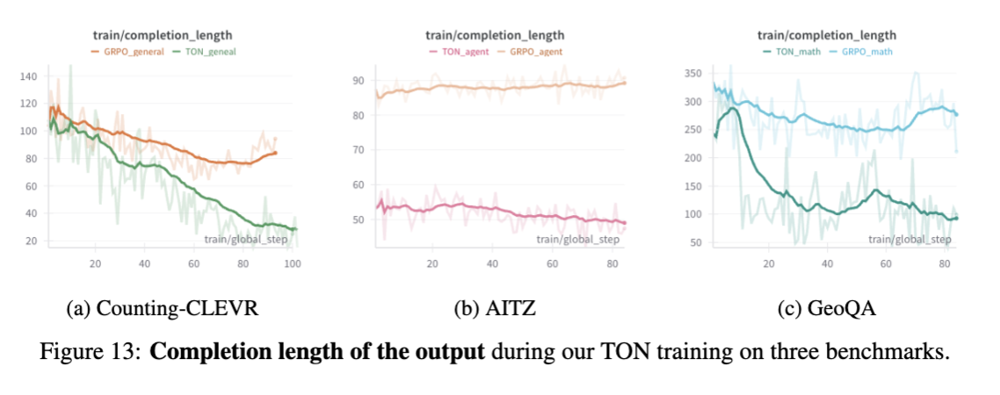
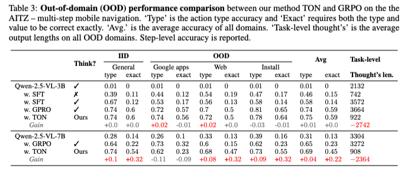

<p align="center">
<h1 align="center"> Think or Not? Selective Reasoning via Reinforcement Learning for Vision-Language Models</h1>
</p>
<p align="center">
  	<a href="https://img.shields.io/badge/version-v0.1.0-blue">
      
    </a>
  <a >
       
  	</a>
  <a >
       
  	</a>
   	<a href="https://github.com/kokolerk/TON/stargazers">
       
  	</a>
  	<a href="https://github.com/kokolerk/TON/network/members">
       
  	</a>
    <a href="https://github.com/kokolerk/TON/issues">
      
    </a>
    <br />
</p>
<div align="center">
<p align="center">
  <a href="#Abstract">Abstract</a>/
  <a href="#Updates">Updates</a>/
  <a href="#Resources">Resources</a>/
  <a href="#Training">Training</a>/
  <a href="#Evaluation">Evaluation</a>/
</p>
</div>
TL;DR: We propose TON (**T**hink-**O**r-**N**ot), an effcient policy optimization method for vision-language models.

# Abstract

Reinforcement Learning (RL) has proven to be an effective post-training strategy for enhancing reasoning in vision–language models (VLMs). Group Relative Policy Optimization (GRPO) is a recent prominent method that encourages models to generate complete reasoning traces before answering, leading to increased token usage and computational cost. Inspired by the human-like thinking process—where people skip reasoning for easy questions but think carefully when needed—we explore how to enable VLMs to first decide *when reasoning is necessary*. To realize this, we propose *TON*, a two-stage training strategy:

1. **(i)** A supervised fine-tuning (SFT) stage with a simple yet effective “**thought dropout**” operation, where reasoning traces are randomly replaced with empty thoughts. This introduces a think-or-not format that serves as a cold start for selective reasoning.
2. **(ii)** A GRPO stage that enables the model to freely explore when to think or not, while maximizing task-aware outcome rewards.

Experimental results show that *TON* can *reduce the completion length by up to **90%** compared to vanilla GRPO, without sacrificing performance or even improving it*. Further evaluations across diverse vision-language tasks—covering a range of reasoning difficulties under both 3B and 7B models—consistently reveal that the *model progressively learns to bypass unnecessary reasoning steps as training advances*. These findings shed light on the path toward human-like reasoning patterns in reinforcement learning approaches.


# Updates

- 2025-05-19: We update the next-version code, model and data source.
- 2025-03-28: We release the TON repo.

# Resources 

## Models

We release our models both in huggingface and modelscope.

|                | huggingface                                                  | Modelscope                                                   |
| -------------- | ------------------------------------------------------------ | ------------------------------------------------------------ |
| 🤗 TON-3B-AITZ  | [TON-3B-AITZ](https://huggingface.co/collections/kolerk/ton-682ad9038395c21e228a645b) | [TON-3B-AITZ](https://modelscope.cn/collections/TON-e8836d13bd564e) |
| 🤗 TON-3B-CLEVR | [TON-3B-CLEVR](https://huggingface.co/collections/kolerk/ton-682ad9038395c21e228a645b) | [TON-3B-CLEVR](https://modelscope.cn/collections/TON-e8836d13bd564e) |
| 🤗 TON-3B-Math  | [TON-3B-Math](https://huggingface.co/collections/kolerk/ton-682ad9038395c21e228a645b) | [TON-3B-Math](https://modelscope.cn/collections/TON-e8836d13bd564e) |
| 🤗 TON-7B-Math  | [TON-7B-Math](https://huggingface.co/collections/kolerk/ton-682ad9038395c21e228a645b) | [TON-7B-Math](https://modelscope.cn/collections/TON-e8836d13bd564e) |

## Datasets

We release our training datasets both in huggingface and modelscope.

|             | huggingface                                                  | Modelscope                                                   |
| ----------- | ------------------------------------------------------------ | ------------------------------------------------------------ |
| 🤗 AITZ-SFT  | [AITZ-SFT](https://huggingface.co/collections/kolerk/ton-682ad9038395c21e228a645b) | [AITZ-SFT](https://modelscope.cn/collections/TON-e8836d13bd564e) |
| 🤗 AITZ-GRPO | [AITZ-GRPO](https://huggingface.co/collections/kolerk/ton-682ad9038395c21e228a645b) | [AITZ-GRPO](https://modelscope.cn/collections/TON-e8836d13bd564e) |
| 🤗 Math-SFT  | [Math-SFT](https://huggingface.co/collections/kolerk/ton-682ad9038395c21e228a645b) | [Math-SFT](https://modelscope.cn/collections/TON-e8836d13bd564e) |
| 🤗 Math-GRPO | [Math-GRPO](https://huggingface.co/collections/kolerk/ton-682ad9038395c21e228a645b) | [Math-GRPO](https://modelscope.cn/collections/TON-e8836d13bd564e) |

- Supported Evaluations

1. SuperCLEVR-200: Item Counting Problems
2. AITZ: Mobile Agent Navigation Problems
3. GeoQA-Test: Geometry Reasoning

## Training

The comparsion of the completion length and skip think ratio during the training process between our TON and vanilla GRPO is as follows: 




1. Set up the environments:

```
conda create -n r1-v python=3.11

conda activate r1-v

bash setup.sh
```

1. Download the training datasets:

We submit our SFT and GRPO stage raw data in [TON](https://modelscope.cn/collections/TON-e8836d13bd564e).  Take the AITZ dataset for example.

- First, download the data

```
modelscope download --dataset wjqkoko/TON-AITZ-SFT ----local_dir <your local path>
```

Then unzip the dataset by run:  `unzip android_in_the_zoo.zip`

- Second, change the JSONs in different directories to a single JSON

```
python src/eval/aitz_evaluate/process_data.py
```

- Third, change the process data to the SFT format or the GRPO format

```
python src/eval/aitz_evaluate/sft_grpo_data.py
```

We also provide the aitz_sft.json in the dataset, you can directly use it for SFT and only transform the data to the GRP format.

1. Download the model:

Our repo currently supports Qwen2.5-VL-3B/7B, which supports the mobile use and computer use functions.

We also provide our models, which have been well-trained on Count, AITZ, and GeoQA in [TON](https://modelscope.cn/collections/TON-e8836d13bd564e).

1. Train the model with GRPO

The training command is as follows: you need to modify it by your local model path (QWEN_PATH), dataset path (HF_DATASET), and output save path(OUTPUT_DIR). We also support wandb to monitor the training process by setting the run name (RUN_NAME).

For Counting/GeoQA

```
sh src/scripts/run_grpo_vllm_qwen25vl.sh
```

For AITZ

```
sh src/scripts/run_grpo_vllm_qwen25vl_gui.sh
```

> [!NOTE]
>
> 1. If you meet **OOM Error**, you can try reduce `-num_generations`

## Evaluation

- AITZ



We currently give the evaluation codes of the training datasets on src/scripts/llama_factory_test.sh.

You need to first download the [LLaMA-Factory](https://github.com/hiyouga/LLaMA-Factory) and then configure the environments following its readme.

You need to first modify the AITZ raw data to the sft format following the same steps previously, then edit the dataset name and path in dataset_format.json.

You can test your model by running it to generate predicted results of AITZ:

```
sh src/scripts/llama_factory_test.sh
```

You can test your output results by running the following code:

```
python src/eval/aitz_evaluate/test_qwen25vl_aitz_from_json.py
```

- GeoQA Counting


To evaluate on GeoQA and counting, you need to first transform the data format by running the code:

```
python src/eval/parquet_data.py
```

1. You can test your model by running it to evaluate math:

```
python src/eval/test_qwen25vl_geoqa.py
```

2. You can test your model by running it to evaluate counting:

```
python src/eval/test_qwen25vl_counting_superclevr.py
```


# TON Team 

[Jiaqi Wang](https://github.com/kokolerk) · [Qinghong Lin](https://scholar.google.com/citations?user=EvbGjlUAAAAJ&hl=zh-CN)· [Binghui Xie](https://scholar.google.com/citations?user=krUTLTkAAAAJ&hl=zh-CN)· [Dongchi Huang](https://github.com/hggforget) · [Ming Hu]() · [Xiaojun Guo](https://zero-lab-pku.github.io/personwise/guoxiaojun/)· [Qixun Wang](https://novaglow646.github.io/QixunWang-Homepage.github.io/) · [Qiguang Chen](https://lightchen233.github.io/)  · [James Cheng](https://www.cse.cuhk.edu.hk/~jcheng/) · [Mike Z. SHOU](https://scholar.google.com/citations?user=h1-3lSoAAAAJ&hl) 

# Acknowledgements

We sincerely thank [DeepSeek](https://github.com/deepseek-ai/DeepSeek-R1), [Open-R1](https://github.com/huggingface/open-r1), [QwenVL](https://github.com/QwenLM/Qwen2.5-VL), [Open-R1-Multimodal](https://github.com/EvolvingLMMs-Lab/open-r1-multimodal), [R1-V](https://github.com/Deep-Agent/R1-V?tab=readme-ov-file) (our initial codebase). We sincerely thank Dongchi Huang for his invaluable guidance on the code and for providing essential computational resources. We also appreciate Binghui Xie’s insightful discussion on topic selection and idea suggestions. Additionally, we are grateful to Qiguang Chen and Yuxuan Wan for their thoughtful and constructive feedback on this paper. Finally, we extend our gratitude to Xiaojun Guo and Qixun Wang for their valuable advice on visual reasoning and the GRPO series methods.
